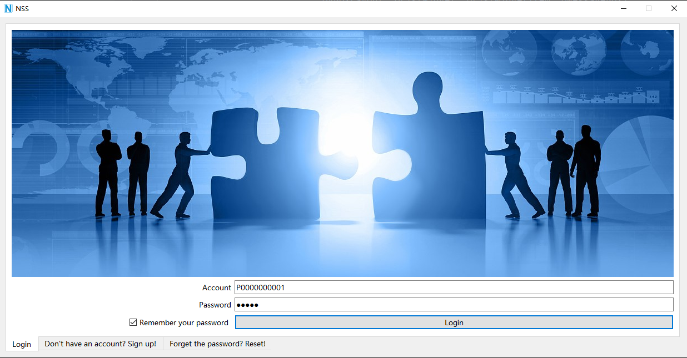
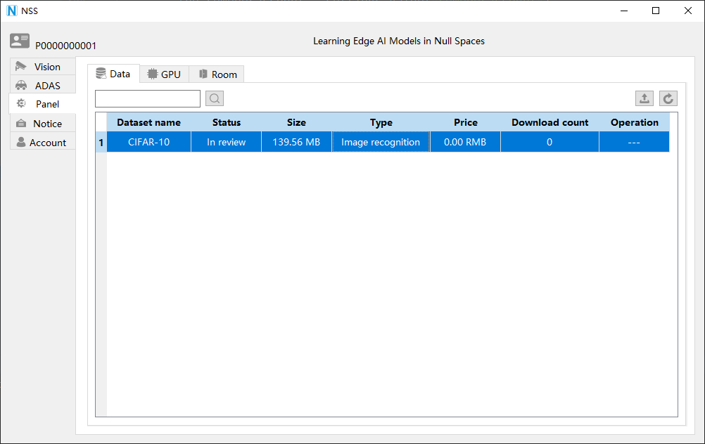
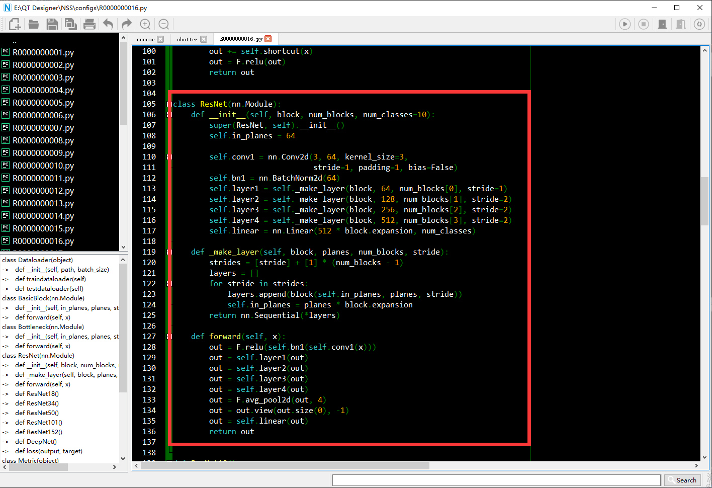

# NSS
Federated NSS is an framework for machine learning
and other computations on decentralized data. NSS has been 
developed to facilitate experimentation with 
Federated Learning (FL), a subspace learning approach to machine 
learning where a shared global model is trained across many 
participating clients that
keep their training data locally.

## Usage
### - Run backend services
1. First make sure that mysql is installed on your server.
```shell
service mysqld status 
```
will check the sql service even though the service is running fine 
and you can log into the MySQL prompt using mysql -uroot -p and start executing queries 
without any problems.

2. Configure the three settings.py for the database in 
   NSS-Backend/DATASET/DATASET/settings.py, NSS-Backend/MATRIX/MATRIX/settings.py 
   and NSS-Backend/NSS/NSS/settings.py.
   A dictionary containing the settings for 
   all databases to be used with Django.
   Following connection parameters will be required.
   
```python
DATABASES = {
    'default': {
        'ENGINE': 'django.db.backends.mysql',
        'NAME': 'mydatabase',
        'USER': 'mydatabaseuser',
        'PASSWORD': 'mypassword',
        'HOST': '172.18.112.69',
        'PORT': '3306',
        }
}
```
Then execute migrations
```shell
cd NSS-Backend/NSS/
python manage.py makemigrations
python manage.py migrate
```

3. Run three backend services with different ports.
```shell
cd NSS-Backend/DATASET/
python manage.py runserver 172.18.112.69:23333
```
This **DATASET** service is used to react the client requests for upload or 
download dataset for simulation.

```shell
cd NSS-Backend/NSS/
python manage.py runserver 172.18.112.69:23334
```
This **NSS** service is used to react the client HTTP requests for frontend operations, e.g., 
a button is clicked for login in or sign up.
```shell
cd NSS-Backend/MATRIX/
python manage.py runserver 172.18.112.69:23335
```
This **MATRIX** service is used to receive the training parameters of the model in the client,
and then update the global model and response the updated model to participating clients.

### - Run frontend GUI
```shell
python nss.py
```
You can register an individual account and login into NSS as follows:

After login in, you can upload your dataset to the server and download datasets in server 
to your local machine.

You can edit and customize the training model locally by the developed IDE, and upload 
it to the server, and then other 
participating clients can parse the training model to participate the training concurrently.
